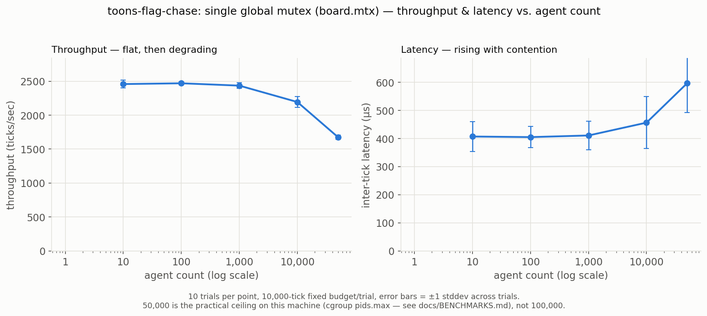

# toons-flag-chase — README

[](https://github.com/Darcythiam/toons-flag-chase/actions/workflows/ci.yml)

Multithreaded cartoon race simulation with three Disney-inspired characters, each having unique abilities, rendered as **stacked ASCII boards** in the console.

---

## 🎮 Gameplay

* **RoadRunner (R)** — lightning fast and occasionally bursts with an extra step.
* **Coyote (C)** — can **jump over** a blocked cell (like walls or other characters) sometimes.
* **YosemiteSam (Y)** — can **shoot** and **freeze** another Toon for a short duration.

The race ends when any Toon reaches the flag (`F`) at the right edge of the board.

---

## ⚙️ Features

* **Thread-per-character concurrency** — each Toon runs on its own thread.
* **Stacked ASCII frame rendering** — each update prints a full board followed by a blank line.
* **Event feed** — logs when Coyote jumps or YosemiteSam shoots.
* **Dynamic tuning** via command-line arguments.

---

## 🧩 Command-Line Options

```
--rows N             Grid height (default 18)
--cols N             Grid width (default 36)
--toons N            Number of Toons (default 3: R, C, Y; any positive N, roles cycle)
--delay-ms N         Delay between frames (default 120)
--max-steps N        Hard cap on total steps taken (default 10000; also the
                      per-trial tick budget under --benchmark/--sweep)
--shoot-chance X     YosemiteSam shooting chance (default 0.15)
--shoot-cooldown N   Cooldown in ms between shots (default 1500)
--freeze-ms N        Freeze duration after being hit (default 1000)
--jump-chance X      Coyote jump chance (default 0.25)
--seed N             Random seed (default system-generated)
--no-render          Skip per-frame board/event printing (stress runs)
--benchmark          Run --benchmark-trials trials at --toons; report
                      throughput + frame latency (see docs/BENCHMARKS.md)
--benchmark-trials N Trials per --benchmark/--sweep point (default 10)
--sweep              Run --benchmark across --sweep-counts, write --csv-out
--sweep-counts LIST  Comma-separated agent counts (default "10,100,1000,10000,100000")
--csv-out PATH       Sweep CSV output (default bench_global_mutex_baseline.csv)
```

---

## 🚀 Build Instructions

### Option 1: Using CMake

```bash
cmake -S . -B build -DCMAKE_BUILD_TYPE=Release
cmake --build build
./build/toons
```

### Option 2: Using g++ directly

```bash
cd src
g++ -std=c++17 -O2 -pthread main.cpp -o ../toons
cd ..
./toons
```

---

## 🧠 Example Runs

```bash
# Default (stacked frames, moderate delay)
./toons

# Faster output
./toons --delay-ms 60

# Aggressive abilities
./toons --shoot-chance 0.25 --freeze-ms 1200 --jump-chance 0.35
```

---

## 🧱 Output Example

```
+------------------------------------+
|.R...........#..................F..|
|...................................|
|..#.................Y..............|
|...........C.......................|
+------------------------------------+
steps: 57

[Update] YosemiteSam shoots Coyote — frozen for 1000 ms

+------------------------------------+
|..R..............................F.|
|...................................|
|...................................|
|...........C.......................|
+------------------------------------+
steps: 63
```

---

## 🧮 Notes

* Each Toon runs independently with mutex synchronization.
* YosemiteSam’s cooldown and freeze state are per-agent timestamps checked
  under `board.mtx` — no timer threads are spawned (see Concurrency
  Invariants below for why that changed).
* Coyote’s jump only triggers if movement is blocked.
* RoadRunner’s burst step is small but frequent, making him visually faster.

---

## 🔒 Concurrency Invariants

This is a **single-global-lock design**: `board.mtx` is the only lock
guarding shared board state, and every access to it goes through the same
mutex — agent positions (`toonPos`), freeze deadlines (`frozen_until`),
shoot cooldowns (`next_shot_ok`), per-agent step counts (`steps`), and the
render grid (`cell`/`grid`, via `rebuild_grid`). There is no per-agent or
per-field sharding; a worker thread touching any of that state acquires the
exact same `board.mtx` that every other worker acquires.

A second mutex, `render_mtx`, exists purely to serialize `stdout` writes
inside `log_event` (the small "[Update] ... " event lines). It is
completely independent of board state — it protects nothing but `cout`.

**Lock order.** The two call sites of `log_event` (Coyote's jump message
and YosemiteSam's shoot message, in `src/main.cpp`) both execute while the
surrounding `board.mtx` critical section is still open, so `render_mtx` is
always acquired *underneath* an already-held `board.mtx`. The invariant is:

> `board.mtx` is always acquired before `render_mtx`; `render_mtx` is never
> held while attempting to acquire `board.mtx`.

Because there is exactly one lock in the board-state critical path
(`render_mtx` never nests the other way around it), lock-order deadlock is
structurally impossible here by construction, not by convention — there's
no second board-state lock to acquire out of order. To keep it that way as
the code changes, every acquisition site uses `BoardLock`/`RenderLock`
(thin RAII wrappers around `board.mtx`/`board.render_mtx` in
`src/main.cpp`) instead of a bare `lock_guard`. `RenderLock` sets a
thread-local flag while `render_mtx` is held; `BoardLock` asserts that flag
is clear before locking `board.mtx`. In a debug build (no `-DNDEBUG` — true
for the TSan/ASan configs in `docs/SANITIZERS.md`, false for the default
Release build) a future contributor who adds a `render_mtx`-then-`board.mtx`
path will hit that assertion immediately instead of introducing a latent
deadlock.

**Why this matters, concretely:** the single-lock design is *why* the
`frozen_until` data race documented in `docs/SANITIZERS.md` was possible in
the first place. It wasn't a case of two locks racing each other or being
acquired out of order — `board.mtx` already covered every write to
`frozen_until`. The bug was a *read* of `board.frozen_until[t]` that simply
never took `board.mtx` at all, bypassing the one lock that existed rather
than exposing a gap between two locks. The fix was closing that unguarded
read (taking `board.mtx` for it, same as every other access), not adding a
second lock — there was, and still is, only one lock guarding board state.

### How much does that one lock actually cost?

`--benchmark`/`--sweep` (see `docs/BENCHMARKS.md` for full methodology,
exact commands, and two measurement bugs caught and fixed while building
this) measure it directly rather than leaving it as a guess:



| Agents | Throughput (ticks/sec) | Latency (µs) | Lock wait |
|---|---|---|---|
| 10 | 2457.6 ± 57.9 | 407.1 ± 53.2 | — |
| 100 | 2469.2 ± 22.0 | 405.0 ± 37.8 | — |
| 1,000 | 2434.6 ± 40.5 | 410.8 ± 51.5 | 99.9% |
| 10,000 | 2193.3 ± 80.1 | 456.5 ± 92.6 | 100.0% |
| 50,000 | 1676.8 ± 31.9 | 596.6 ± 103.7 | — |

(10 trials/point, fixed 10,000-tick budget/trial, fixed board size across
every tier so agent count is the only variable; lock-wait % from a separate
instrumented build measuring each thread's own `board.mtx` wait time
against its own lifetime — see `docs/BENCHMARKS.md`. `50,000`, not
`100,000`, is this machine's practical ceiling: a hard `pids.max` cgroup
limit on the whole session, confirmed via `dmesg`, not a software limit in
this codebase.)

**Yes — the single global mutex is the dominant bottleneck, and the data
says so directly, not just by implication.** Throughput is flat within
noise from 10 to 1,000 agents (a 1.4% spread — that's scheduling jitter,
not a trend), then drops 11.2% by 10,000 agents and 32.1% by 50,000 agents;
latency rises the mirror amount. More agents past roughly 1,000 don't add
throughput on this codebase — they add threads contending for the one lock
everything goes through. The lock-wait measurement confirms this isn't
just curve-shape inference: at 1,000 agents and above, worker threads
already spend essentially 100% of their wall-clock lifetime either holding
`board.mtx` or blocked waiting for it. This benchmark run is a
**measurement of the current design, not a fix** —
`bench/bench_global_mutex_baseline.csv` is the coarse-grained-lock baseline
that a later synchronization-strategy comparison (finer-grained locking,
lock-free structures, etc.) will be measured against; that redesign is out
of scope here.

